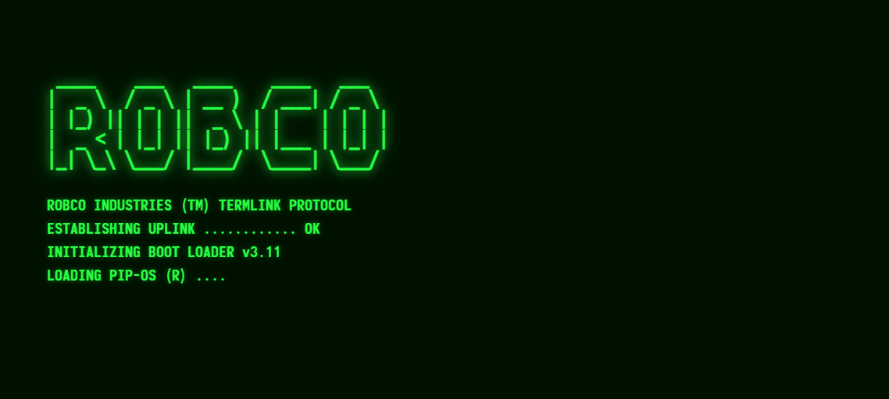
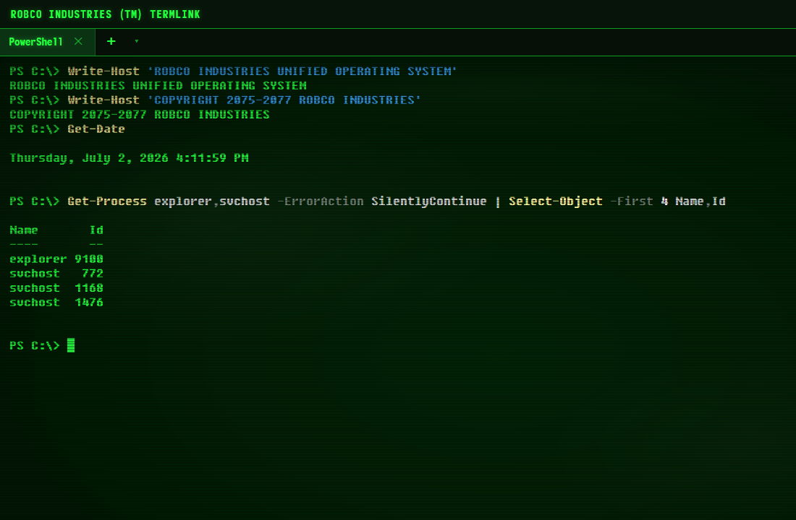

# FalloutTerminal

A fully functional Windows terminal styled after the RobCo terminals from the Fallout series.
Real shells, real tabs, real work — rendered like a 200-year-old phosphor CRT.





## Features

**A real terminal**

- Real Windows shells via ConPTY: PowerShell, PowerShell 7, Command Prompt, Git Bash, WSL — plus your own custom profiles
- Tabs (rename by double-click, drag to reorder) and **split panes** with draggable dividers
- Saved workspaces: store a named set of tabs, restore it in one click
- Search the scrollback, clickable URLs, copy/paste with multi-line paste protection, 5,000-line scrollback with flow control
- Session restore: your tabs come back on launch

**The Fallout part**

- Three phosphor themes — **Pip-Boy**, **Terminal**, **Amber** — in *authentic mono* or *hybrid ANSI* color mode (real git/ls colors on the CRT)
- CRT effects with four levels (off/low/medium/high): scanlines, per-glyph phosphor glow, vignette, flicker, burn-in
- RobCo boot sequence on launch (skippable), CRT power-off collapse on close
- **Monofonto** — the font from the in-game terminals — for the UI and default text; Fixedsys Excelsior, Share Tech Mono, and VT323 bundled; upload your own `.ttf`/`.otf`
- Synthesized sound design: CRT hum, key clicks, boot and power-off sounds (toggleable)
- A faithful **RobCo hacking minigame** (`Ctrl+Shift+H`) — likeness scoring, bracket duds, 4 attempts, lockout

**Windows citizenship**

- Quake mode: summon/dismiss from anywhere with a global hotkey (default `Ctrl+Shift+` `` ` ``)
- System tray, optional close-to-tray, optional start-with-Windows
- Remembers window size/position, snaps and maximizes like any native app
- Auto-updates from GitHub releases (installed builds)

## Install

Grab the latest [release](https://github.com/spezzuti/FalloutTerminal/releases):

- **`FalloutTerminal-x.y.z-setup.exe`** — installer with Start Menu/desktop shortcuts and auto-update *(recommended)*
- **`FalloutTerminal-x.y.z-portable.exe`** — single file, no install, no auto-update

> The binaries are unsigned, so Windows SmartScreen may warn on first run — choose *More info → Run anyway*.

## Keyboard shortcuts

| Keys | Action |
|---|---|
| `Ctrl+Shift+T` / `Ctrl+Shift+W` | New tab / close pane (tab when last) |
| `Ctrl+Tab` / `Ctrl+Shift+Tab` | Next / previous tab |
| `Ctrl+Shift+D` / `Ctrl+Shift+S` | Split right / split down |
| `Ctrl+Shift+C` / `Ctrl+Shift+V` | Copy selection / paste (right-click also copies/pastes) |
| `Ctrl+Shift+F` | Search scrollback |
| `Ctrl` `+` / `-` / `0` | Font zoom in / out / reset |
| `Ctrl+Shift+.` / `Ctrl+Shift+,` | Cycle theme / cycle CRT level |
| `Ctrl+Shift+H` | RobCo hacking minigame |
| `Ctrl+Shift+` `` ` `` | Global summon/dismiss (works system-wide) |
| Double-click tab | Rename tab |

Everything else — themes, fonts, cursor, CRT intensity, sounds, profiles, workspaces, import/export — lives behind the **⚙** button.

## Building from source

Requirements: Node.js 20+, Visual Studio 2022 Build Tools (C++ workload + Windows SDK), Python 3.11.

```powershell
npm install        # builds the native ConPTY module
npm run dev        # development with hot reload
npm run make       # package installer + portable exe into release/
```

## Built with

[Electron](https://www.electronjs.org/) · [xterm.js](https://xtermjs.org/) · [node-pty](https://github.com/microsoft/node-pty) · [electron-builder](https://www.electron.build/)

Bundled fonts: [Monofonto](https://typodermicfonts.com/monofonto/) (Typodermic freeware), [Fixedsys Excelsior](https://github.com/kika/fixedsys) (public domain), Share Tech Mono and VT323 (SIL OFL).

## Disclaimer

This is an unofficial fan project. *Fallout*, *RobCo*, and *Pip-Boy* are trademarks of Bethesda Softworks / ZeniMax Media. This project is not affiliated with or endorsed by them.

## License

MIT
